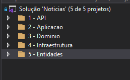

# API Noticias usando DDD

## API de Noticias desenvolvida com dotnet 5.0

#### Estrutura do projeto

#### Dependencias 

- Microsoft.Extensions.Identity.Stores
- Microsoft.EntityFrameworkCore.SqlServer
- Microsoft.AspNetCore.Identity.EntityFrameworkCore
- Microsoft.EntityFrameworkCore.Tools
- Microsoft.EntityFrameworkCore.Design
- Microsoft.AspNetCore.Identity.UI

Foram usadas nos Projetos 

1 - API
4 - Infraestrutura
5 - Entidades

